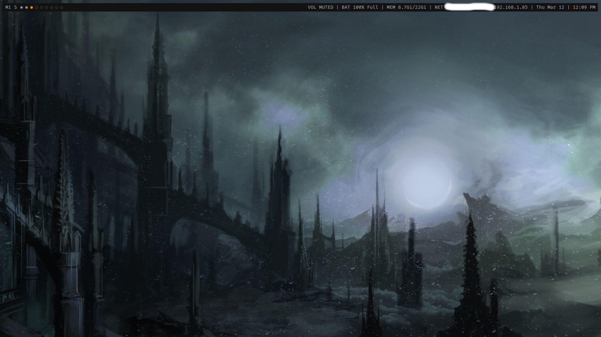
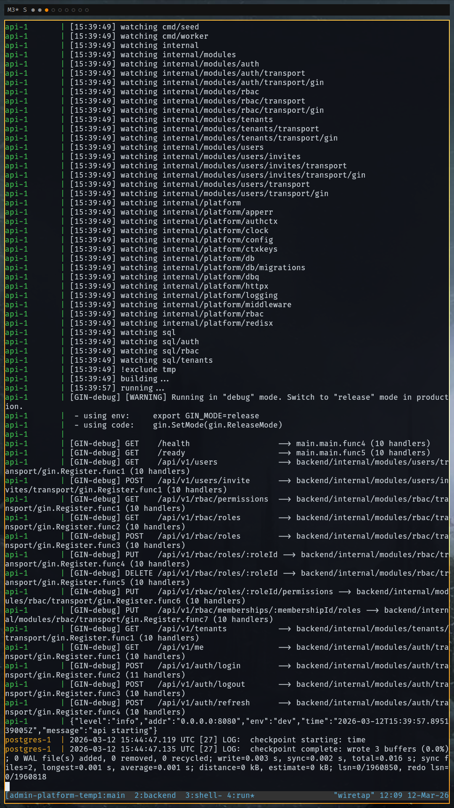

# vwm

**vwm** is a lightweight tiling window manager for **X11** written in **C** using **XCB** and **Xft**.

The goal of the project is to provide a small, understandable window manager that is easy to modify, fast to compile, and simple to configure.

vwm focuses on:

* minimal and readable code
* predictable tiling behavior
* multi-monitor support
* a lightweight status bar
* configuration through a simple config file
* live configuration reload

---

# Preview

## Screenshots

### Main setup


### Vertical monitor


## Video demonstration


---

# Features

* master/stack tiling layout
* monocle layout
* floating windows
* scratchpad terminal
* multi-monitor support (RandR)
* workspace synchronization toggle
* UTF-8 window titles
* customizable status bar input through root window name
* configurable colors and fonts
* live config reload (`SIGHUP`)
* simple config format with include support

---

# Requirements

vwm requires **X11** and will not run directly under Wayland.

Dependencies:

* X11
* XCB
* XCB RandR
* XCB ICCCM
* XCB Keysyms
* Xft
* Fontconfig
* Xrender
* pkg-config
* a C compiler

---

# Installing Dependencies

## Arch Linux

```bash
sudo pacman -S --needed \
  base-devel pkgconf \
  libx11 libxcb \
  xcb-util-wm xcb-util-keysyms \
  libxft fontconfig libxrender
````

## Ubuntu / Debian

```bash
sudo apt install -y \
  build-essential pkg-config \
  libx11-dev libx11-xcb-dev \
  libxcb1-dev libxcb-randr0-dev \
  libxcb-icccm4-dev libxcb-keysyms1-dev \
  libxft-dev libfontconfig1-dev \
  libxrender-dev
```

## Fedora

```bash
sudo dnf install -y \
  gcc make pkgconf-pkg-config \
  libX11-devel libX11-xcb-devel \
  libxcb-devel \
  xcb-util-wm-devel \
  xcb-util-keysyms-devel \
  libXft-devel fontconfig-devel \
  libXrender-devel
```

---

# Building

Clone the repository:

```bash
git clone https://github.com/veasman/vwm
cd vwm
```

Compile:

```bash
make
```

---

# Installation

vwm includes an install script for a cleaner setup flow.

Install the binary and desktop entry:

```bash
sudo ./scripts/install.sh
```

By default this installs:

* `vwm` to `/usr/local/bin/vwm`
* `vwm.desktop` to `/usr/local/share/xsessions/vwm.desktop`

If the example config does not already exist in your home directory, you can copy it with:

```bash
mkdir -p ~/.config/vwm
cp example/config.conf ~/.config/vwm/config.conf
cp example/theme.conf ~/.config/vwm/theme.conf
```

---

# Uninstall

To remove the installed files:

```bash
sudo ./scripts/uninstall.sh
```

This removes the files installed by `install.sh`.

Your personal config files in `~/.config/vwm/` are not deleted.

---

# Running vwm

Add this line to your `.xinitrc`:

```bash
exec vwm
```

Then start X:

```bash
startx
```

If using a display manager, the installed desktop entry should allow vwm to appear as a session option.

---

# Configuration

vwm is configured using a simple config file located at:

```text
~/.config/vwm/config.conf
```

A default example config is included in:

```text
example/config.conf
```

The config format is intentionally minimal and kitty-like:

```text
key value
```

Comments begin with `#`.

Example:

```conf
terminal kitty
launcher rofi -show drun
scratchpad kitty
scratchpad_class vwm-scratchpad

font_family JetBrainsMono Nerd Font
font_size 11

gap_px 10
border_width 2
default_mfact 0.5

bar_height 22
bar_outer_gap 0

sync_workspaces yes

include ~/.config/vwm/theme.conf
```

---

## Include Support

vwm supports including another config file from the main config:

```conf
include ~/.config/vwm/theme.conf
```

Included files are loaded in order and can override values from the main config.

This makes it easy to keep a stable base config while swapping theme files or generating theme overrides from external tools.

Example layout:

```text
~/.config/vwm/config.conf
~/.config/vwm/theme.conf
```

Example main config:

```conf
terminal kitty
launcher rofi -show drun
scratchpad kitty
scratchpad_class vwm-scratchpad

default_mfact 0.5
sync_workspaces yes

include ~/.config/vwm/theme.conf
```

Example included file:

```conf
bar_bg 0x111111
bar_fg 0xd0d0d0
border_active 0xff8800
border_inactive 0x444444
workspace_current 0xff8800
workspace_occupied 0x8c8c8c
workspace_empty 0x4a4a4a
```

---

## Program Commands

These define the programs launched by various keybindings.

| Option             | Description                                         |
| ------------------ | --------------------------------------------------- |
| `terminal`         | Terminal emulator launched with **Mod + Enter**     |
| `launcher`         | Application launcher used by **Mod + p**            |
| `scratchpad`       | Terminal used for the scratchpad                    |
| `scratchpad_class` | Window class used to identify the scratchpad window |

Example:

```conf
terminal kitty
launcher rofi -show drun
scratchpad kitty
scratchpad_class vwm-scratchpad
```

Commands may include arguments:

```conf
launcher rofi -show drun
```

---

## Fonts

The status bar uses **Xft** for font rendering.

| Option        | Description                      |
| ------------- | -------------------------------- |
| `font_family` | Font family name                 |
| `font_size`   | Font size used in the status bar |

Example:

```conf
font_family JetBrainsMono Nerd Font
font_size 11
```

---

## Layout Settings

These control tiling behavior.

| Option          | Description                     |
| --------------- | ------------------------------- |
| `gap_px`        | Gap between tiled windows       |
| `border_width`  | Window border width             |
| `default_mfact` | Default master area width ratio |

Example:

```conf
gap_px 10
border_width 2
default_mfact 0.55
```

`default_mfact` controls how much space the master window takes.
Values typically range between **0.4** and **0.7**.

---

## Bar Settings

These control the appearance and placement of the status bar.

| Option          | Description                               |
| --------------- | ----------------------------------------- |
| `bar_height`    | Height of the bar                         |
| `bar_outer_gap` | Gap between the bar and the monitor edges |

Example:

```conf
bar_height 24
bar_outer_gap 6
```

---

## Workspace Behavior

| Option            | Description                                         |
| ----------------- | --------------------------------------------------- |
| `sync_workspaces` | If enabled, all monitors switch workspaces together |

Accepted boolean values include:

```text
yes / no
true / false
on / off
1 / 0
```

Example:

```conf
sync_workspaces yes
```

When disabled, each monitor maintains its own independent workspace.

The current state is shown in the bar:

```text
S = synced workspaces
L = local workspaces
```

---

## Colors

Colors are defined using hexadecimal RGB values:

```text
0xRRGGBB
```

| Option               | Description                       |
| -------------------- | --------------------------------- |
| `bar_bg`             | Status bar background color       |
| `bar_fg`             | Status bar text color             |
| `border_active`      | Border color of focused window    |
| `border_inactive`    | Border color of unfocused windows |
| `workspace_current`  | Current workspace indicator       |
| `workspace_occupied` | Workspace containing windows      |
| `workspace_empty`    | Empty workspace indicator         |

Example:

```conf
bar_bg 0x111111
bar_fg 0xd0d0d0
border_active 0xff8800
border_inactive 0x444444
workspace_current 0xff8800
workspace_occupied 0x8c8c8c
workspace_empty 0x4a4a4a
```

---

# Reloading Configuration

The configuration can be reloaded without restarting the window manager:

```bash
kill -HUP $(pidof vwm)
```

This reloads the config and reapplies settings immediately.

---

# Status Bar

The status bar reads the **root window name**.

You can set the text using:

```bash
xsetroot -name "CPU 10% | RAM 4G | $(date '+%H:%M')"
```

This allows integration with tools such as:

* dwmblocks
* slstatus
* custom shell scripts

The bar itself stays lightweight. Richer status formatting is expected to come from whatever external tool you use to generate the root window name.

---

# Keybindings

| Key                 | Action                          |
| ------------------- | ------------------------------- |
| Mod + Enter         | Launch terminal                 |
| Mod + Shift + Enter | Move window to master           |
| Mod + p             | Launcher                        |
| Mod + `             | Scratchpad terminal             |
| Mod + j             | Focus next window               |
| Mod + k             | Focus previous window           |
| Mod + h             | Focus previous monitor          |
| Mod + l             | Focus next monitor              |
| Mod + Shift + h     | Move window to previous monitor |
| Mod + Shift + l     | Move window to next monitor     |
| Mod + [             | Decrease master width           |
| Mod + ]             | Increase master width           |
| Mod + f             | Toggle fullscreen               |
| Mod + s             | Toggle workspace sync           |
| Mod + q             | Close window                    |
| Mod + Shift + q     | Quit window manager             |
| Mod + Shift + r     | Reload configuration            |
| Mod + 1-9           | Switch workspace                |
| Mod + Shift + 1-9   | Send window to workspace        |

---

# Scratchpad

The scratchpad is a hidden floating terminal that can be toggled.

Default binding:

```text
Mod + `
```

The scratchpad command is defined in the config:

```conf
scratchpad kitty
scratchpad_class vwm-scratchpad
```

---

# Project Goals

vwm is intended to be:

* small
* hackable
* readable
* stable

It is not intended to replicate large feature-heavy window managers.

## Wayland Support

Long-term, the project aims to explore a Wayland-based version of vwm while maintaining the same design philosophy: minimal code, predictable behavior, and easy customization.

The current implementation targets X11, but the architecture is being developed with the possibility of a future Wayland compositor in mind.

## More Flexible Status Bar Customization

The current status bar reads the root window name, which allows integration with tools such as dwmblocks or custom scripts.

Future versions aim to expand this system to support:

* richer formatting
* icons and styled segments
* improved layout flexibility
* easier configuration of bar elements
* while still keeping the implementation lightweight

---

# License

MIT License


